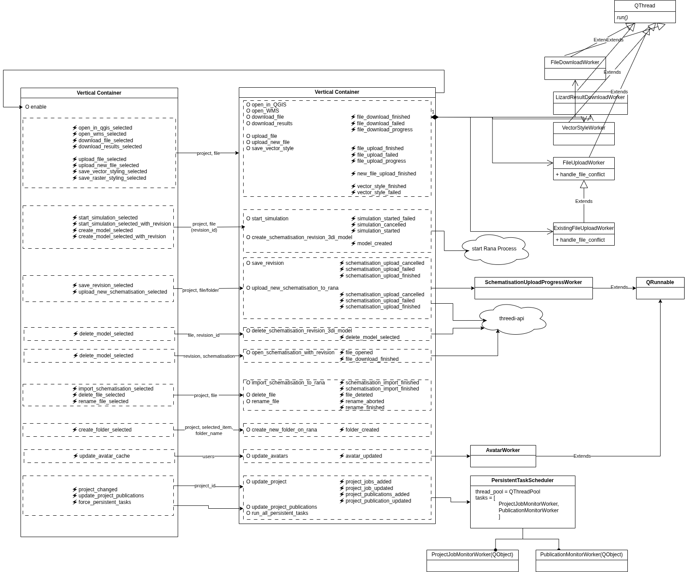

# rana-qgis-plugin

A QGIS Rana plugin for exploring files in the Rana project.

This plugin is directly dependent on the Dependency Loader.

## Architecture

The main UI component is the RanaBrowser. Most interaction of the user with the plugin happens here. This component is connected via signals to the RanaLoader. The RanaLoader class deals with (down)loading all files (possible into QGIS).

All uploading and downloading tasks (running in a separate QThread) are in worker.py.



## Local development notes

On Linux, local development happens with docker to make sure we're working in a nicely
isolated environment. To start the development environment, run the following commands::

    $ docker compose build
    $ xhost +local:docker
    $ docker compose up

## Releasing

Make sure you have `zest.releaser` with `qgispluginreleaser` installed. The
`qgispluginreleaser` ensures the metadata.txt, which is used by the qgis plugin
manager is also updated to the new version. To make a new release enter the following
command:

```
    fullrelease
```

This creates a new release and tag on github. Github actions are configured to also
create this zip and upload it to https://plugins.lizard.net/ when a new tag is
created, using the `upload-artifact.sh` script.

It is also possible to release manually. First make sure the version in the metadata is set correctly.

    $ python3 zip_plugin.py
    $ ARTIFACTS_KEY=abcdefg ./upload-artifact.sh

The `ARTIFACTS_KEY` environment variable needs to be set in order to upload the plugin to https://plugins.lizard.net (which is the same as
https://plugins.3di.live).
