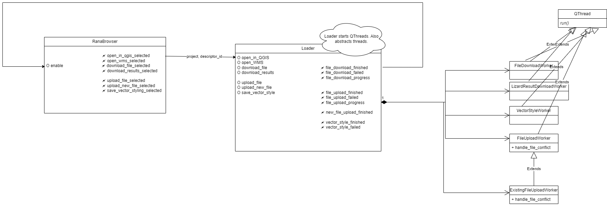

# rana-qgis-plugin

A QGIS Rana plugin for exploring files in the Rana project.

This plugin is directly dependent on the Dependency Loader.

## Architecture

The main UI component is the `RanaBrowser`. Most interaction of the user with the plugin happens here. This component is connected via signals to the `Loader`. The `Loader` class deals with (down/up)loading of all files.

Some tasks (e.g. upload or downloading) that are time consuming are done in separate workers, including:

File download in the `FileDownloadWorker`, file upload in the `FileUploadWorker` and vector style upload the `VectorStyleWorker`. The workers are defined in `rana_qgis_plugin/workers.py`. Note that these workers are `QThread` instances.



## Authentication

The Rana Desktop Client (RDC) connects to the Rana backend via the API
using OAuth2 authentication workflow. The OAuth2 authentication is configured
via the `setup_oauth2` method in `rana_qgis_plugin/auth.py`.

Once you logged in to Rana, it also attempts to configure authentication for
3Di using a 3Di personal API key. Your 3Di personal API key is generated
automatically via the Rana API in case there is none yet. The 3Di authentication
is configured via the `setup_3di_auth` method in `rana_qgis_plugin/auth_3di.py`.

## Related 3Di plugins

The installer for the Rana Desktop Client (RDC) is in the [3Di Modeller Interface](https://github.com/nens/threedi-modeller-interface-installer).

Currently, it is in a separate branch called [rana-desktop-client](https://github.com/nens/threedi-modeller-interface-installer/tree/rana-desktop-client).

Please refer to the above repo for how to deploy the installer to production. The installer can be downloaded at: https://docs.3di.live/modeller-interface-downloads/.

The RDC installer also contains the following 3Di plugins:

- [3Di Models & Simulations](https://github.com/nens/threedi-api-qgis-client)
- [3Di Results Analysis](https://github.com/nens/threedi-results-analysis)
- [3Di Schematisation Editor](https://github.com/nens/threedi-schematisation-editor)
- [N&S Dependency Loader](https://github.com/nens/nens-dependency-loader)

Note that certain functionality is provided by the plugins. E.g. loading results via the 3Di Results Analysis. Function calls
or forwarded to these plugins.

## Rana styling for QGIS

Some basic Rana stylings (e.g. colors, icons) are added to the RDC via the below plugin:

- [Rana QGIS Customisations](https://github.com/nens/rana-qgis-customisations)


## How to make requests in RDC

Currently, there are 2 ways to make requests in RDC:

- Using the `requests` library for requests that do not require authentication
- Using the `Qt Network` library for requests to Rana that require OAuth2 authentication

The `NetworkManager` class uses the Qt Network library to add OAuth2 token to
the requests to Rana. The `NetworkManager` class can be found in
`rana_qgis_plugin/network_manager.py`.


## QGIS / Rana Vector style

Vector styles are stored in QGIS as `*.qml` files. We use a library to convert
these QGIS styles to Maplibre styles for the Rana Web client that is called
[GeoCat/bridge-style](https://github.com/GeoCat/bridge-style).

## Local development notes

On Linux, local development happens with docker to make sure we're working in a nicely
isolated environment. To start the development environment, run the following commands::

    $ docker compose build
    $ xhost +local:docker
    $ docker compose up

## Releasing

Make sure you have `zest.releaser` with `qgispluginreleaser` installed. The
`qgispluginreleaser` ensures the metadata.txt, which is used by the qgis plugin
manager is also updated to the new version. To make a new release enter the following
command:

```
    fullrelease
```

This creates a new release and tag on github. Github actions are configured to also
create this zip and upload it to https://plugins.lizard.net/ when a new tag is
created, using the `upload-artifact.sh` script.

It is also possible to release manually. First make sure the version in the metadata is set correctly.

    $ python3 zip_plugin.py
    $ ARTIFACTS_KEY=abcdefg ./upload-artifact.sh

The `ARTIFACTS_KEY` environment variable needs to be set in order to upload the plugin to https://plugins.lizard.net (which is the same as
https://plugins.3di.live).
