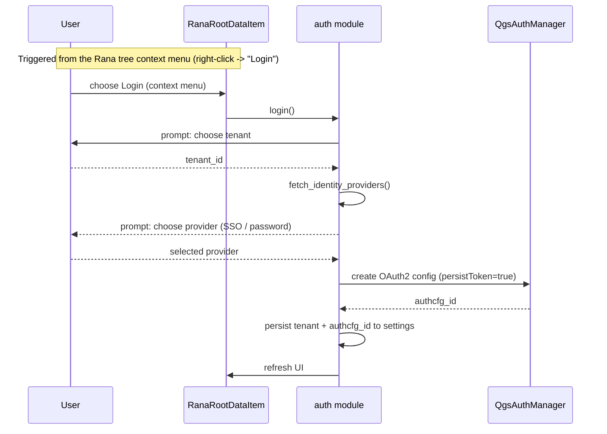
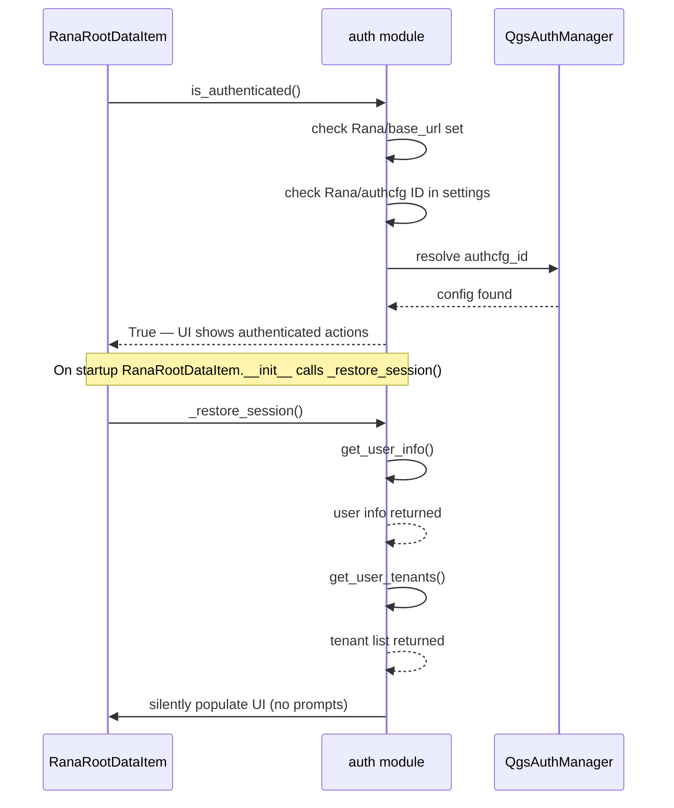
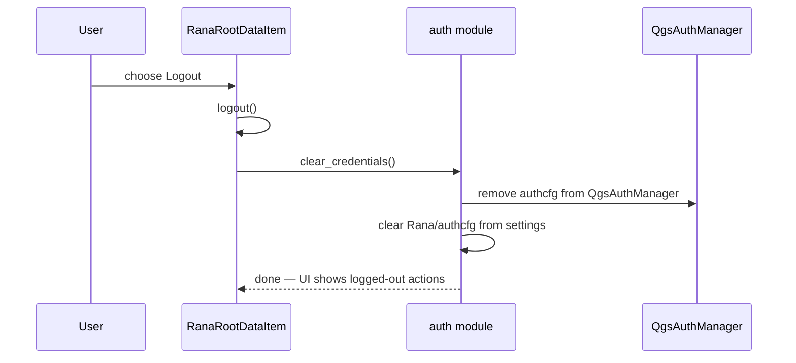
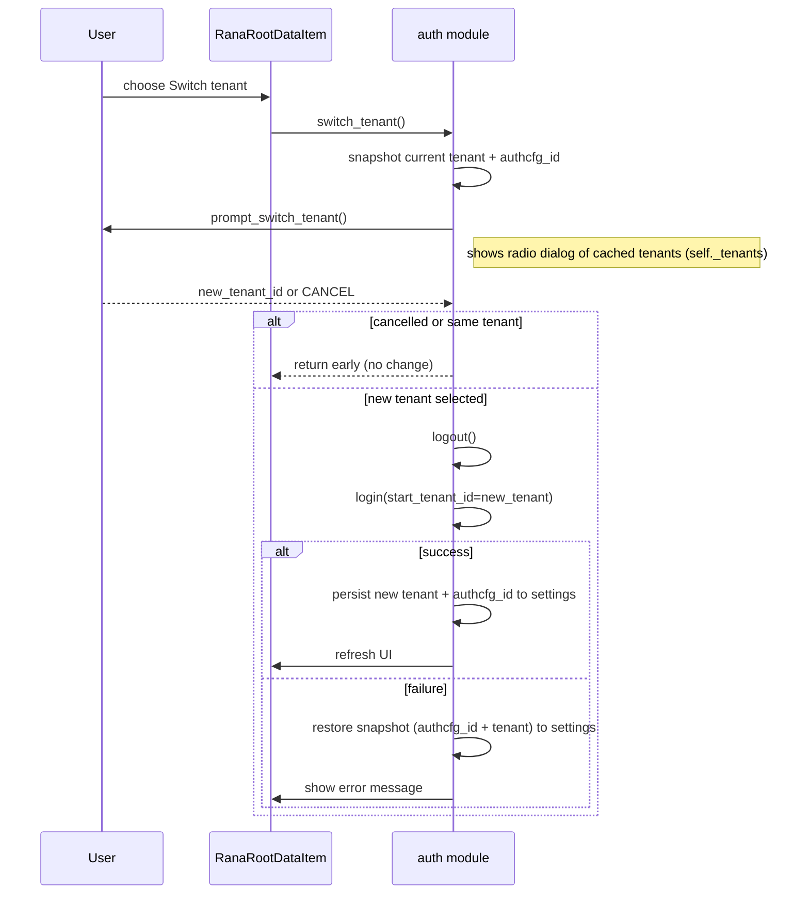

# Rana authentication — developer flow

This living document describes the auth lifecycle for the Rana Browser entrypoint. Update this file whenever auth behaviour changes.

## Architecture note

Auth logic lives in `rana_qgis_plugin/auth.py` as a module of plain functions. All persistent state is stored in `QgsSettings` and `QgsAuthManager` — there is no in-memory state object.

## Login: new user (first time or after logout)

The user has no stored tenant or authcfg. They must pick a tenant and authentication method.

## Login: returning user (after restart)

Tenant and authcfg ID are already stored. QGIS Auth Manager still holds the token (persisted). No user interaction needed.

Key notes:
- On restart, if all three conditions pass, the user is immediately signed in — no prompts shown.
- __init__ calls _restore_session() which fetches user info and the cached tenant list (get_user_info(), get_user_tenants()) so the UI is populated silently.
- If the authcfg ID is in settings but not found in `QgsAuthManager` (stale), it is removed from settings automatically and the user is treated as signed out (see `is_authenticated()` contract below).
- OAuth2 config creation writes secrets/tokens into QGIS Auth Manager; only the config ID is persisted to Rana settings.

## Logout

RanaRootDataItem.logout() calls auth.clear_credentials() which removes the QGIS authcfg and the stored settings pointer.

## Tenant switch (with rollback)

Notes:
- The tenant list presented in prompt_switch_tenant() is the cached self._tenants fetched during login/restore — it is not fetched fresh during switch_tenant().
- Flow order: prompt happens before logout; logout only occurs after a new tenant is chosen. If the user cancels or re-selects the current tenant, no logout occurs.
- Rollback rule: if re-login for the new tenant fails at any step, the prior authcfg ID and tenant MUST be restored in settings so the user is not left logged-out.

## is_authenticated() contract

`is_authenticated()` MUST return `True` iff ALL of the following are true:
1. A backend URL is configured in settings (`Rana/base_url`), AND
2. A stored authcfg ID is present in settings (`Rana/authcfg`), AND
3. That authcfg ID resolves to a config in `QgsAuthManager`.

If an authcfg ID is present in settings but does NOT resolve in `QgsAuthManager` (stale pointer), the implementation MUST automatically remove the stored ID from settings. No network probe is required — resolution against `QgsAuthManager` is sufficient.

## Security: URL-change-forces-logout

In the Settings dialog open_settings() workflow the following happens:

1. Dialog opens
2. On Accepted and dlg.url_changed() is True:
   - Remove stored tenant entry (`RANA_TENANT_ENTRY`)
   - Call `clear_credentials()` (removes authcfg from QGIS Auth Manager)
   - Reset `_tenants = None`
   - Update tooltip and refresh UI
   - If the user WAS authenticated before opening settings: automatically trigger `self.login()` to start a fresh login flow

This is done explicitly in open_settings(), not via an external settings listener.

## Fetching Cognito client IDs from the backend (`update_auth_settings`)

Different backend deployments (e.g. staging vs. production) run their own Cognito user pools and therefore have different client IDs. The plugin must use the client IDs that match the configured backend URL; hardcoding them is not possible.

When the user saves a new backend URL in the Settings dialog, `update_auth_settings(new_url)` is called before the dialog is accepted:

1. Stores the new URL in settings.
2. Calls `GET <new_url>/api/frontend-settings` synchronously.
3. On success: stores `default_client_id` (used for SSO flows) and `native_client_id` (used for username/password flows) in `QgsSettings`.
4. On failure: reverts the URL to the previous value and returns `False` — the dialog shows an error and stays open.

These stored client IDs are then read by `create_oauth2_config()` when building the OAuth2 config for a login attempt. This means `update_auth_settings` must succeed before any login against a new backend is possible.

## When to update this document

Any change to login sequences, the `is_authenticated()` contract, rollback behaviour, or the URL-change rule MUST be reflected here before merging.
