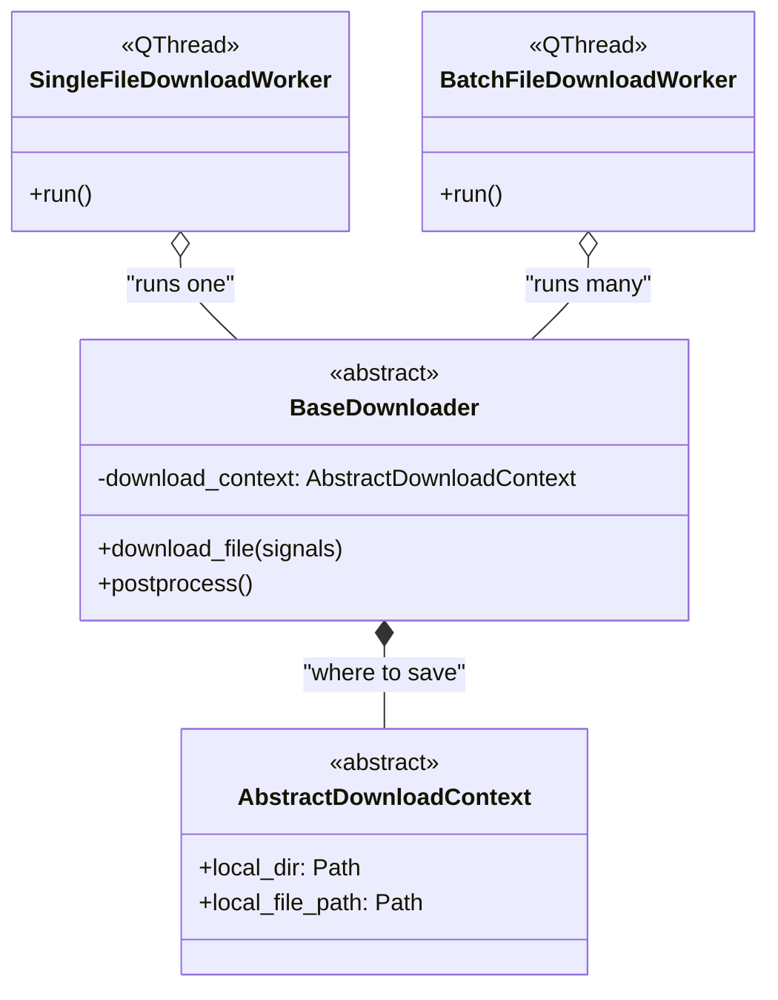
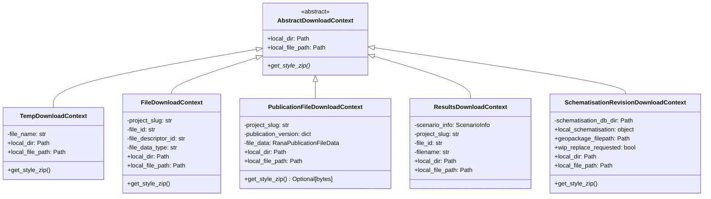
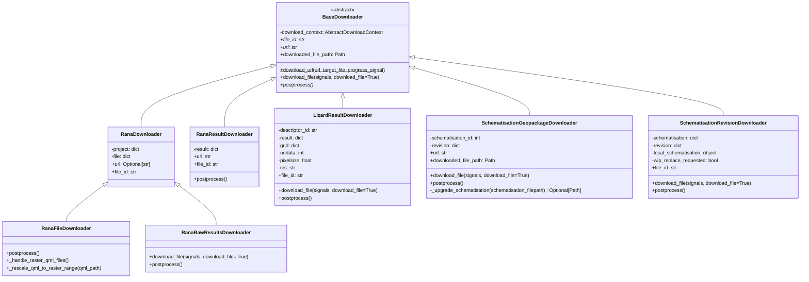

# Download Worker Class Diagram

## Overview

The download worker system separates the concerns of **where** files are saved, **what** needs to be downloaded, and **how** the download is coordinated. 

**Download contexts** determine the destination path and styling retrieval strategy. For example, tenant files go into project-based folders, while schematisations go into temporary directories.

**Downloaders** know what to download and how to process it. They receive a context at construction time, fetch files from the appropriate API (Rana or 3Di), and perform any necessary post-processing like extracting archives or upgrading schemas.

**Workers** coordinate the download in background threads to keep the UI responsive. They create downloaders, run them, and communicate progress and results back to the main thread via Qt signals.

This separation means you can mix and match contexts with downloaders (e.g., download a schematisation to either a temp directory or a project folder) without duplicating code, and new download types can be added by creating new context or downloader classes. 

## Download Contexts

Download contexts implement the **where** and **styling** aspects of downloading:

- **TempDownloadContext**: Creates temporary directories under `rana_downloads/` for transient files (e.g., schematisations during processing)
  - Used for files that don't need persistent project-based storage
  - Automatically creates unique temporary subdirectories

- **FileDownloadContext**: Manages downloads for tenant files within a project structure
  - Uses `get_local_dir_structure()` to create project/file-based paths
  - Retrieves QML styling from file descriptors via API
  - Typical use: downloading individual project files from Rana

- **PublicationFileDownloadContext**: Handles publication-specific versioned downloads
  - Creates directory structure based on publication version and file tree
  - Retrieves QML styling from publications (with fallback to file descriptor)
  - Preserves publication folder hierarchy during download

- **ResultsDownloadContext**: Manages downloads for lizard scenario results
  - Resolves target folder based on whether a 3Di simulation is linked
  - If linked: saves to the simulation results folder in the 3Di working directory
  - If not: falls back to the standard project file directory structure
  - Takes a `filename` parameter to determine the final file path

- **SchematisationRevisionDownloadContext**: Manages downloads of full schematisation revisions
  - Target directory is resolved before construction (dialog on main thread)
  - Stores metadata populated during download: `local_schematisation`, `geopackage_filepath`, `wip_replace_requested`
  - Downloads the revision zip to the schematisation database directory

All contexts provide:
- `local_dir`: The directory where the file will be saved
- `local_file_path`: The complete path including filename
- `get_style_zip()`: Retrieves QML styling data (if applicable)

## Downloaders

Downloaders implement the **what** and **how** aspects of downloading:

- **RanaDownloader**: Base downloader for files stored in a Rana project
  - Provides download URL via `get_tenant_file_url()` and `file_id`
  - Subclasses implement `postprocess()` for file-type-specific handling

- **RanaFileDownloader**: Downloads a tenant file and applies QML styling
  - Extends `RanaDownloader`
  - Used for raster and vector files that have associated style data
  - Extracts QML zip, renames `physical_quantity.qml`, rescales to raster data range

- **RanaRawResultsDownloader**: Downloads and extracts raw scenario result zips
  - Extends `RanaDownloader` (same URL pattern, different postprocess)
  - Extracts zip into target directory, handles nested log zips, removes the zip
  - Stores warning signal from `download_file()` for use in `postprocess()`

- **RanaResultDownloader**: Downloads pre-generated result rasters
  - Downloads via `result["attachment_url"]`
  - Uses the default `BaseDownloader.download_file()` flow
  - Simple: download to `local_file_path`, no post-processing

- **LizardResultDownloader**: Downloads results requiring on-demand raster generation
  - Splits extent into tiles, requests generation from Lizard API
  - Polls until tiles are ready, then downloads each tile
  - Builds VRT if multi-tile
  - Progress: 0-10% requesting, 10-90% downloading tiles, 90-100% VRT

- **SchematisationGeopackageDownloader**: Specialized downloader for 3Di schematisation geopackages (used in schematisation export)
  - Downloads from 3Di API using schematisation and revision IDs
  - Post-processes by:
    1. Extracting the zip archive
    2. Upgrading schematisation to latest schema version (with error handling)
    3. Adding revision number to filename (e.g., `model (rev5).gpkg`)
  - Uses cached URL property to avoid repeated API calls
  - Emits warnings if upgrade fails (continues with original version)

- **SchematisationRevisionDownloader**: Downloads a full schematisation revision via `download_required_files`
  - Used for opening/batch-downloading schematisations from the file browser
  - Directory resolution must happen before construction (main thread dialog or automatic resolution)
  - Downloads revision files to the resolved schematisation database directory
  - Populates `download_context.local_schematisation` and `geopackage_filepath` on success

All downloaders provide:
- `file_id`: Unique identifier for deduplication in batch downloads
- `download_file()`: Core download logic with progress tracking and error handling
- `postprocess()`: File processing after download (extraction, transformation)
- `_handle_qml_extraction()`: QML styling extraction for supported file types

## Workers

Workers coordinate the download process in separate QThreads to prevent UI blocking:

- **SingleFileDownloadWorker**: Simple worker for downloading one file
  - Creates a `FileDownloadWorkerSignals` instance for communication
  - Calls `downloader.download_file()` in the thread's `run()` method
  - Used for on-demand single file downloads

- **BatchFileDownloadWorker**: Optimized worker for downloading multiple files
  - Downloads unique files only once (deduplication by file ID)
  - Copies already-downloaded files to additional required locations
  - Tracks downloaded file paths in `downloaded_files` dictionary
  - Useful when multiple layers reference the same underlying file
  - Emits `all_finished` signal after entire batch completes

Both workers:
- Inherit from `QThread` for background execution
- Use `FileDownloadWorkerSignals` for Qt signal-based communication
- Emit progress updates (percentage + current file)
- Emit success (`finished`) or failure (`failed`) signals
- Support warning messages (e.g., schema upgrade failures)

## Signal Communication
All workers use **FileDownloadWorkerSignals** to communicate with the main thread:
- `progress(int, str)`: Download progress percentage and current file message
- `finished()`: Individual file download completed successfully
- `failed(str)`: Download failed with error message
- `all_finished()`: All files in batch completed (BatchFileDownloadWorker only)
- `warning(str)`: Non-fatal warnings (e.g., schematisation upgrade issues)

## Usage in Loader

The Loader class demonstrates three main usage patterns for the download workers:

### 1. Single File Download (Tenant Files)

- Uses `FileDownloadContext` to save to project-specific directories in `files` folder and downloads styling for file from Rana
- Uses `RanaFileDownloader` to fetch from tenant API
- `SingleFileDownloadWorker` handles everything for a single file

### 2. Batch Download (Publications)

- Uses `PublicationFileDownloadContext` to save to publication specific directories in `publications` folder of the project and downloads layer specific styling from Rana
- Creates multiple `RanaFileDownloader` instances, one per file
- `BatchFileDownloadWorker` handles downloading multiple files:
  - automatically deduplicates files by ID
  - asks confirmation for large downloads (>10 files)

### 3. Schematisation export

**Key points:**
- Uses `TempDownloadContext` for transient files
- `SchematisationGeopackageDownloader` fetches from 3Di API and automatically extracts zip, upgrades schema, adds revision number to filename
- `SingleFileDownloadWorker` handles everything for a single file

### 4. Schematisation Download (File Browser)

**Key points:**
- Uses `SchematisationRevisionDownloadContext` with a pre-resolved directory
- `SchematisationRevisionDownloader` downloads the revision via `download_required_files`
- `SingleFileDownloadWorker` runs the download in a background thread
- On completion, opens the schematisation in the editor via `LayerManager.add_from_schematisation()`

### 5. Batch Download (File Browser)

**Key points:**
- Loader's `download_files()` creates a list of downloaders based on file types:
  - `threedi_schematisation` → `SchematisationRevisionDownloader` (auto-resolves directory)
  - `scenario` → `RanaRawResultsDownloader` (raw zip) + `RanaResultDownloader` (default result raster if available)
  - Other types → `RanaFileDownloader` (standard tenant file download)
- Skipped files (missing metadata, no revision, etc.) are reported to the user
- `BatchFileDownloadWorker` handles downloading all files sequentially
  - Deduplicates by `file_id`
  - Asks confirmation for large downloads (>10 files)
  - Reports success/failure/warning counts on completion

### 6. Single File Results Download (File Browser)

**Key points:**
- Loader's `download_results()` builds a list of downloaders for one scenario file:
  - `RanaRawResultsDownloader` (if raw download requested)
  - For each selected result: `RanaResultDownloader` (if `attachment_url`) or `LizardResultDownloader` (if generation needed)
- Uses `ResultsDownloadContext` with appropriate filename per downloader
- Checks for existing files and prompts overwrite/skip/cancel
- `BatchFileDownloadWorker` handles downloading all downloaders sequentially

