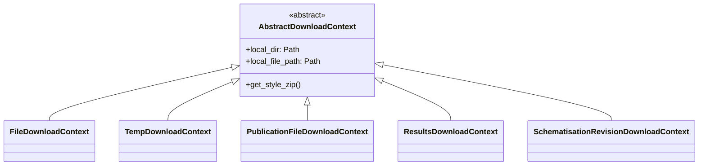
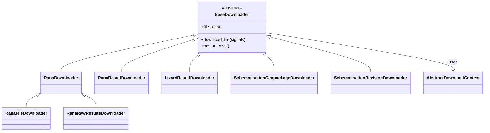
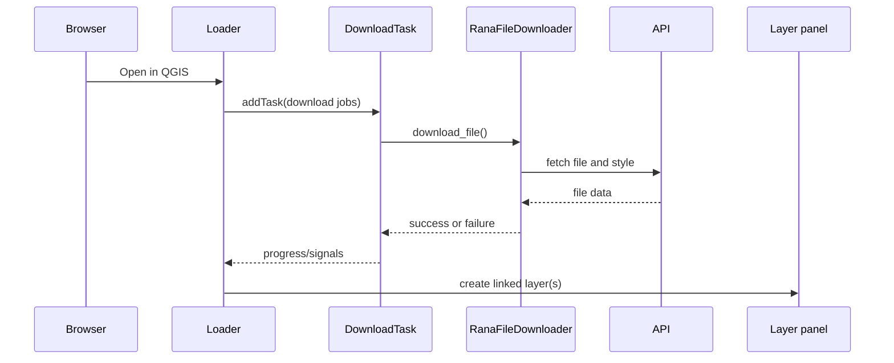

# Downloads

## Overview

Downloads are split into three responsibilities:

- **Download contexts** determine where a file is stored and how associated
  styling is retrieved.
- **Downloaders** know how to fetch and post-process a particular resource.
- **`DownloadTask`** runs one or more downloaders sequentially in the QGIS
  task manager, keeping the UI responsive.

The current orchestration uses `DownloadTask` (`QgsTask`).

## Contexts and downloaders

### Download contexts

```mermaid
classDiagram
    class AbstractDownloadContext {
        <<abstract>>
        +local_dir: Path
        +local_file_path: Path
        +get_style_zip()
    }
    class FileDownloadContext
    class TempDownloadContext
    class PublicationFileDownloadContext
    class ResultsDownloadContext
    class SchematisationRevisionDownloadContext
    AbstractDownloadContext <|-- FileDownloadContext
    AbstractDownloadContext <|-- TempDownloadContext
    AbstractDownloadContext <|-- PublicationFileDownloadContext
    AbstractDownloadContext <|-- ResultsDownloadContext
    AbstractDownloadContext <|-- SchematisationRevisionDownloadContext
```

### Downloaders and task coordination

```mermaid
classDiagram
    class BaseDownloader {
        <<abstract>>
        +file_id: str
        +download_file(signals)
        +postprocess()
    }
    class RanaDownloader
    class RanaFileDownloader
    class RanaRawResultsDownloader
    class RanaResultDownloader
    class LizardResultDownloader
    class SchematisationGeopackageDownloader
    class SchematisationRevisionDownloader

    BaseDownloader <|-- RanaDownloader
    RanaDownloader <|-- RanaFileDownloader
    RanaDownloader <|-- RanaRawResultsDownloader
    BaseDownloader <|-- RanaResultDownloader
    BaseDownloader <|-- LizardResultDownloader
    BaseDownloader <|-- SchematisationGeopackageDownloader
    BaseDownloader <|-- SchematisationRevisionDownloader
    BaseDownloader --> AbstractDownloadContext : uses
```

`AbstractDownloadContext` exposes `local_dir` and `local_file_path`. The
current tenant-file flow uses `FileDownloadContext`, which derives paths from
the Rana project/file information and can retrieve the file's QML styling.

Contexts implement the destination and optional styling lookup:

- `TempDownloadContext` manages transient files in a temporary directory.
- `FileDownloadContext` stores tenant files using the Rana cache and retrieves
  descriptor styling where applicable.
- `PublicationFileDownloadContext` resolves publication/version paths and
  publication styling.
- `ResultsDownloadContext` resolves paths for scenario results.
- `SchematisationRevisionDownloadContext` manages a complete revision's
  destination and result metadata.

Downloaders implement resource-specific download and post-processing:

- `RanaDownloader` provides common tenant-file URL and identity behavior.
- `RanaFileDownloader` downloads vector/raster files and processes QML styles.
- `RanaRawResultsDownloader` downloads and extracts raw result archives.
- `RanaResultDownloader` downloads an existing result attachment.
- `LizardResultDownloader` downloads generated tiles and can build a VRT.
- `SchematisationGeopackageDownloader` downloads, extracts, and upgrades a
  schematisation geopackage.
- `SchematisationRevisionDownloader` downloads a complete revision.

`RanaFileDownloader` downloads a Rana tenant file and performs the applicable
post-processing, including QML extraction for supported vector and raster
files. Other downloader implementations support scenario and schematisation
flows.

Files opened in QGIS use the configured Rana cache location. The cache is
available through the `rana_cache_dir` setting; it defaults to `~/Rana`.

## `DownloadTask`

`DownloadTask` accepts a list of downloaders and processes them in order. It:

1. checks for cancellation before each file;
2. emits `file_started`;
3. runs the downloader and its post-processing;
4. emits `file_failed` for failures or `file_downloaded` on success; and
5. updates task progress.

The loader uses these signals to display progress and to open the downloaded
file in the QGIS layer panel after completion.

```mermaid
sequenceDiagram
    participant Browser
    participant Loader
    participant Task as DownloadTask
    participant Downloader as RanaFileDownloader
    participant API
    participant QGIS as Layer panel

    Browser->>Loader: Open in QGIS
    Loader->>Task: addTask(download jobs)
    Task->>Downloader: download_file()
    Downloader->>API: fetch file and style
    API-->>Downloader: file data
    Downloader-->>Task: success or failure
    Task-->>Loader: progress/signals
    Loader->>QGIS: create linked layer(s)
```

## Opening one or more files

The Browser supports opening a vector file, raster file, or individual vector
layer by double-clicking it or choosing **Open in QGIS**. Files and folders
can also be selected together. Folder selections are traversed recursively,
and overlapping selections are de-duplicated before one batch task is
created. Larger or nested selections require confirmation.

The resulting layers are grouped according to their Rana path. See
[`layer_management.md`](layer_management.md) for the layer-tree side of this
flow.

## Signals

| Signal | Meaning |
|---|---|
| `file_started(str)` | The next download has started. |
| `file_failed(str, str)` | A file failed, with its identifier and error. |
| `file_downloaded(str)` | A file completed; payload is its local path. |

Cancellation is checked between files. A failure is recorded and the task
continues with the remaining jobs; the task result is unsuccessful if any
file failed.
