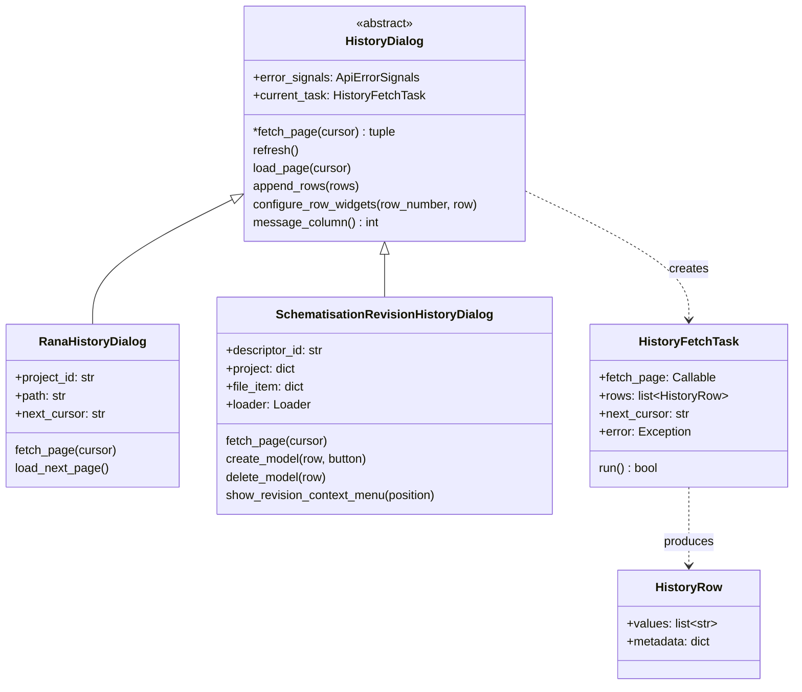
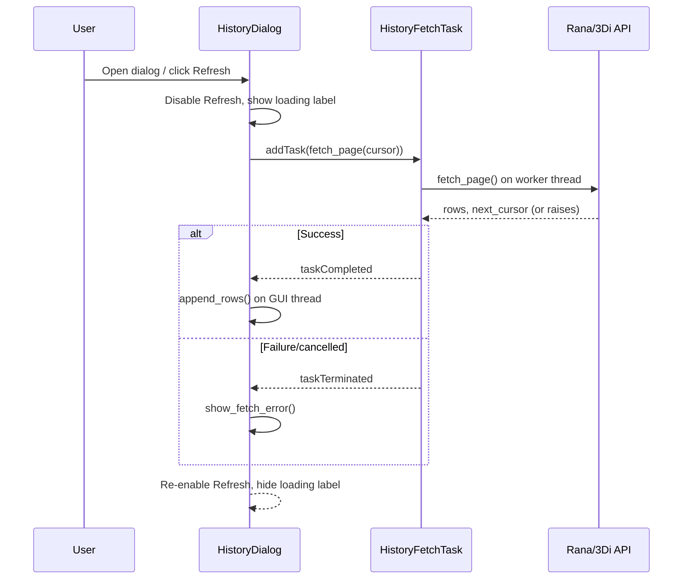

# File and Revision History

## Overview

The **Version history** context-menu action shows read-only history for Rana
files, folders, and the `Files` root, and HCC revision history for
schematisation files. Both views share one asynchronous dialog base:

- `HistoryDialog` owns the table, Refresh control, loading/error labels, and the fetch lifecycle. It has no  Rana or HCC API knowledge.
- `RanaHistoryDialog` implements generic Rana file/folder/project history.
- `SchematisationRevisionHistoryDialog` implements HCC revision history and handles availibity of the `Simulation` and `Rana Model` action buttons.

Fetching of Rana history runs in a `QgsTask` so long histories do not block the QGIS GUI thread and the history is paginated lazily as the user scrolls. Revision history is fetched completely in one request because button enablement
depends on the full revision list.

## Class structure

The base class owns the asynchronous task lifecycle, but not pagination state or scrollbar behavior. `RanaHistoryDialog` adds cursor state and lazy page loading; `SchematisationRevisionHistoryDialog` uses the base one-shot task lifecycle to fetch its complete revision list.

## Fetch lifecycle

## Lazy pagination (generic history)

`RanaHistoryDialog.fetch_page()` requests one cursor page at a time. `RanaHistoryDialog` triggers the next page automatically when the user scrolls the table to the bottom (`load_next_page()`, connected to both `valueChanged` and `rangeChanged` on the vertical scrollbar, since appending  rows can change the scrollbar range without changing its value).

## Schematisation revision history

`SchematisationRevisionHistoryDialog.fetch_page()` receives only the initial `None` cursor from the base lifecycle and always fetches the complete revision list via `ThreediCalls.fetch_schematisation_revisions()`. This is required because the
`Rana Model` button enablement depends on the exact count of revisions that already have a model, compared against `threedimodel_limit`.

| Column | Label | Enabled when | Tooltip when disabled |
|---|---|---|---|
| `Simulation` | `New` | revision has a model | "A Rana model must be created before a simulation can be started." |
| `Rana Model` | `Delete` | revision has a model | — |
| `Rana Model` | `Create` | no model and model count < `threedimodel_limit` | "The maximum number of Rana models has been reached. Please delete one of the existing models before creating a new one." |

### Create / Delete behavior

- **Create** calls `Loader.start_model_tracker_process()`. On success it disables the clicked button for the current dialog instance, changes its tooltip to prompt a manual Refresh, and shows a popup with a link to the Rana processes tab (`get_rana_processes_url()`), including the returned job
  ID when available.
- **Delete** asks for confirmation, then calls `Loader.delete_schematisation_revision_3di_model()` synchronously. On  failure it shows an action error and leaves the table unchanged. On success it calls `refresh()`, which re-fetches the complete revision list so every
  row's model-limit state is recalculated.

**Known limitation:** model-creation state is not tracked after the Create click. There is no polling of the server-side job, and no persisted state across closing/reopening the dialog or restarting QGIS. A user could therefore start a second `Create` for the same revision while an earlier one is still running, by refreshing before the first one completes. 

### Revision row context menu

Right-clicking a revision row (`show_revision_context_menu`) offers:

- **Open** — passes the selected revision's ID through
  `OpenSchematisationRequest(project, file_item, revision_id)` to
  `Loader.open_items()`, so a non-latest revision can be opened explicitly.
  The default double-click/`Open in QGIS` action is unaffected and still
  opens the latest revision.
- **Open in web viewer** — substitutes the selected revision's ID into the
  schematisation's existing `management_url` and opens it with
  `QDesktopServices.openUrl()`.

