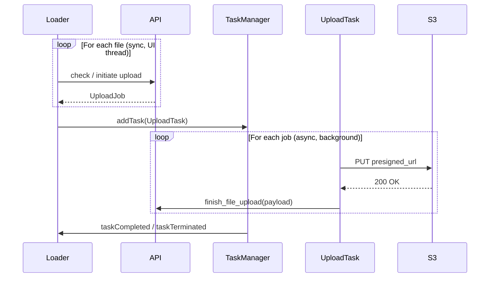
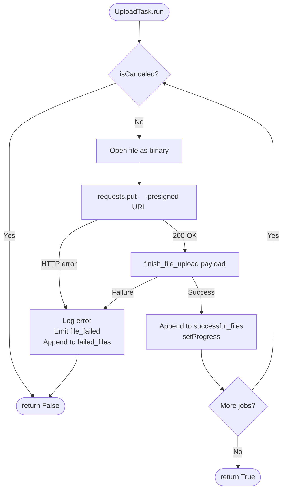

# File Upload

## File upload pipeline

The core upload pipeline has three stages: **preparation** (sync), **execution** (async background), and **completion** (sync callback).

### Stage 1 — Preparation

Preparation resolves what needs to happen before any data is transferred. For each file, the caller:

1. Calls `prepare_new_file_upload()` (first upload or replacement) or `prepare_existing_file_upload()` (re-uploading a tracked file).
2. Handles any `UploadPreparationResult` that comes back — either collecting the resulting `UploadJob` or dealing with the error/conflict.

Only after all files are prepared is the background task created.

#### `prepare_new_file_upload`

Checks whether the file already exists on the server, initiates the upload session, and returns an `UploadJob` with a pre-signed URL ready for execution. As part of preparation the function checks for case-sensitive and case-insensitive filename conflicts and returns that result. 

#### `prepare_existing_file_upload`

Prepares re-upload of a file already tracked on the server. It ensures that the file is on the server and that the local file is newer than the server copy. It returns an `UploadJob` with a pre-signed URL ready for execution.

### Stage 2 — Background execution (`UploadTask`)

`UploadTask` subclasses `QgsTask` and processes a list of `UploadJob` objects in QGIS's thread pool.

Key points:

- Files are streamed in a single `requests.put()` — no chunking. The pre-signed URL is self-authorising; no QGIS auth headers needed for the PUT.
- Cancellation is checked between files, not mid-transfer.

**Signals:**

| Signal | When emitted | Payload |
|--------|-------------|---------|
| `file_started(str)` | Before each PUT | Filename |
| `file_failed(str, str)` | On error | (path, error message) |

### Stage 3 — Completion

After `run()` returns, the caller's completion handler receives the outcome:

- **Success** → all jobs in `successful_files`
- **Failure** → failed files listed in `failed_files`
- **Cancelled** → `isCanceled()` was true

### Known limitations

- **No chunking**: entire file sent in a single PUT — large files risk timeout or high memory use.
- **No HTTP retry**: transient network errors fail the batch immediately.
- **No parallelism**: files upload serially.

## New file upload

`Loader.upload_files()` is the entry point triggered from the project file browser context menu. It owns all user interaction and drives the mechanics above.

### Shapefile conversion

Before calling `prepare_new_file_upload()`, shapefiles (`.shp`) are offered for conversion to GeoPackage via `convert_vectorfile_to_geopackage()`, because Rana does not natively support the Shapefile format. The user can decline or cancel.

### Conflict resolution

When `prepare_new_file_upload()` returns a `conflict_path`, `Loader` presents an `UploadChoice` dialog. Depending on the user's choice it either skips the file, retries preparation with `overwrite_case=True`, or aborts the remaining files.

### Completion handling

`Loader.handle_upload_completed()` is wired to the task's completion signal:

- **Success** → info bar + optional `refresh_callback()`
- **Failure** → error bar listing failed files
- **Cancelled** → warning bar

