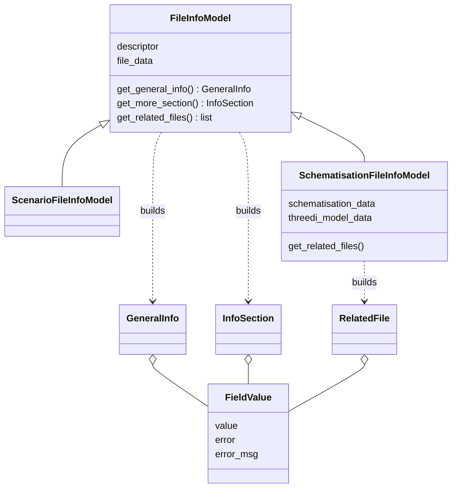
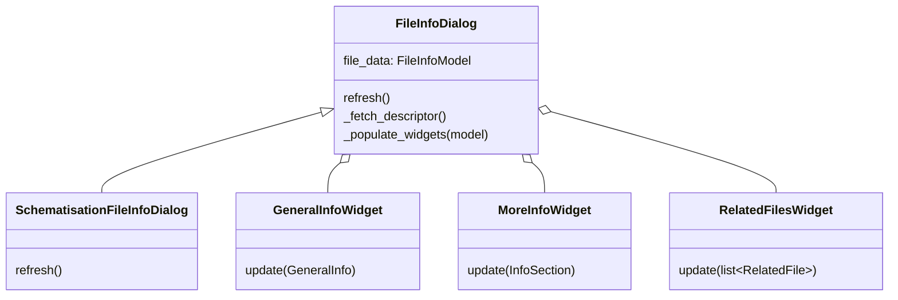
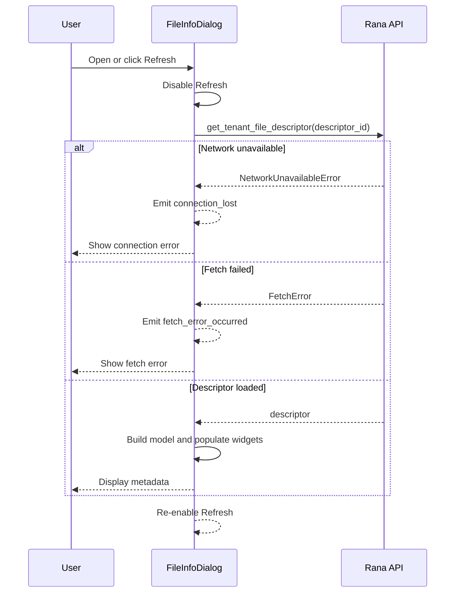

# File Information Documentation

## Overview

The file information feature presents read-only metadata for one Rana file in a Qt dialog. It is split into two layers:

- **Presentation models** in `widgets/file_info_models.py` transform API responses into safe, display-oriented dataclasses.
- **Widgets and dialogs** in `widgets/file_info_dialog.py` render those dataclasses and own fetching, refresh, and error handling.

The model layer does not depend on Qt. This keeps API-shape handling, formatting, and missing-data behavior testable independently from the UI.

## Presentation models

### `FieldValue`

`FieldValue` is the boundary object between uncertain source data and the UI. It contains:

| Attribute | Meaning |
|-----------|---------|
| `value` | Value to display; may be `None` when unavailable |
| `error` | Whether the source value was missing or invalid |
| `error_msg` | Optional diagnostic shown as a tooltip |

`FieldValue.from_dict()` distinguishes an unavailable source dictionary from a missing key. `parse_timestamp()` preserves an invalid API timestamp rather than allowing one malformed field to break the whole dialog.

Widgets render a `None` value as `N/A`; fields marked as errors are displayed in red and expose `error_msg` as a tooltip.

### Shared model data

`FileInfoModel` collects data from the file description for each of the sections in the `FileInfoDialog`:

- **General**: filename, icon type, size, uploader, avatar, description, and last-modified timestamp.
- **More information**: projection, human-readable type, status, and storage size.
- **Related files**: empty for generic files.

`ScenarioFileInfoModel` and `SchematisationFileInfoModel` exent the **More information** section, and `SchematisationFileInfoModel` als adds **Related files**. Note that `SchematisationFileInfoModel` requires also needs a schematisation and a model to fully populate the sections. 

## Widget composition

`FileInfoDialog` contains three collapsible sections inside a resizable scroll area:

1. `GeneralInfoWidget` uses a fixed two-row layout and updates its labels and icons.
2. `MoreInfoWidget` uses a form layout. It reuses existing labels and adds labels only for new row keys.
3. `RelatedFilesWidget` uses a read-only `QTableView` backed by a `QStandardItemModel` with **Name**, **Type**, and **Size** columns.

The `SchematisationFileInfoDialog` modifies the `refresh` method with extra api calls to retrieve the schematisation and 3Di model.

## Refresh and data flow

The standard dialog fetches the tenant file descriptor on construction and whenever **Refresh** is clicked. A successful response selects the model and populates all widgets. The refresh button is disabled during the operation and re-enabled after success or failure.

## Error and missing-data behavior

The dialog must remain usable when individual metadata fields or auxiliary resources are unavailable:

- Missing scalar fields become `N/A` rather than raising during rendering.
- Missing or invalid fields retain an error marker for visual feedback.
- Descriptor connection failures emit `connection_lost` through `ApiErrorSignals`.
- Descriptor fetch failures emit `fetch_error_occurred`.
- Schematisation and 3Di model failures are logged and shown as dialog errors; available sections are still populated.
- The **Refresh** button remains available after an error so the user can retry.

