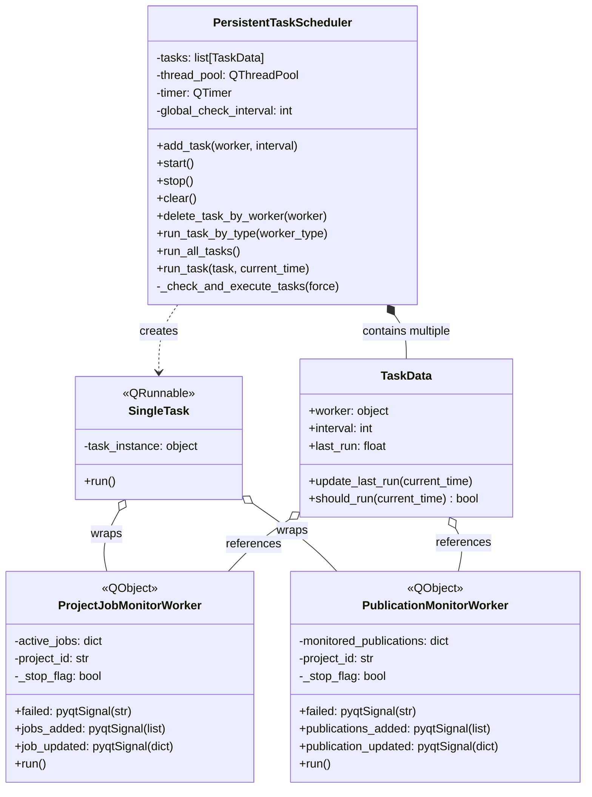

# Persistent Worker Class Diagram

## Overview

The persistent worker system provides background polling for project resources that update over time without user interaction.

**Monitor workers** poll the Rana API for updates to specific resources (jobs or publications). They track what they've seen before and emit signals when new items appear or existing items change state.

**The scheduler** manages these monitor workers on intervals. It runs a timer that checks every second whether any workers need to run based on their polling intervals, executes them in a thread pool, and tracks when each last ran.

This separation means monitor workers focus purely on detecting changes, while the scheduler handles all the timing and threading concerns. New monitor types can be added without changing the scheduler.



## Scheduler

**PersistentTaskScheduler** manages background monitoring tasks on intervals:

- Maintains list of tasks (worker + interval + last run time)
- Runs QTimer every second to check which tasks should execute
- Uses QThreadPool to run tasks in background threads
- Provides `add_task(worker, interval)` to register new monitors
- Provides `run_task_by_type(worker_type)` to force immediate execution of specific monitor type
- Provides `clear()` to remove all tasks (used when switching projects)

Each task is wrapped in `SingleTask` (a QRunnable) for thread pool execution.

## Monitor Workers

Monitor workers poll the API for changes and emit signals when updates are detected.

- **ProjectJobMonitorWorker**: Monitors project jobs (background processes like model generation, simulation tracking). Polls every 10 seconds. Emits `jobs_added` for new jobs, `job_updated` when state or process changes.

- **PublicationMonitorWorker**: Monitors project publications. Polls every 60 seconds. Emits `publications_added` for new publications, `publication_updated` when `updated_at` timestamp changes.

Both workers track what they've seen before (`active_jobs`, `monitored_publications`) to detect changes. They inherit from QObject to emit signals but are executed as QRunnable tasks in the thread pool.

## Usage in Loader

The Loader class sets up persistent monitoring when a project is opened:

### Project Switch

When user switches projects:
- Clears all existing tasks with `persistent_scheduler.clear()`
- Creates new `ProjectJobMonitorWorker` for the project, adds to scheduler with 10-second interval
- Creates new `PublicationMonitorWorker` for the project, adds to scheduler with 60-second interval
- Connects signals to UI update handlers

### On-Demand Refresh

When user explicitly refreshes publications:
- Calls `persistent_scheduler.run_task_by_type(PublicationMonitorWorker)` to force immediate execution
- Bypasses interval check for that specific worker type

### Lifecycle

- Scheduler starts when Loader is initialized (`loader.py:188-189`)
- Scheduler stops when Loader is cleaned up
- Workers run continuously in background while project is open
- UI components connect to worker signals to receive updates

## Signal Flow

```
PersistentTaskScheduler (timer every 1s)
  └─> Checks if worker should run based on interval
      └─> Wraps worker in SingleTask
          └─> Executes in QThreadPool
              └─> Worker.run() polls API
                  └─> Detects changes
                      └─> Emits signals
                          └─> Loader handlers update UI
```

## Design Benefits

- **Non-blocking**: All polling happens in background threads
- **Configurable intervals**: Different resources can poll at different rates
- **Automatic cleanup**: Switching projects automatically clears old monitors
- **Reusable scheduler**: Same scheduler can manage different monitor types
- **Testable**: Workers can be run synchronously for testing by calling `run()` directly
