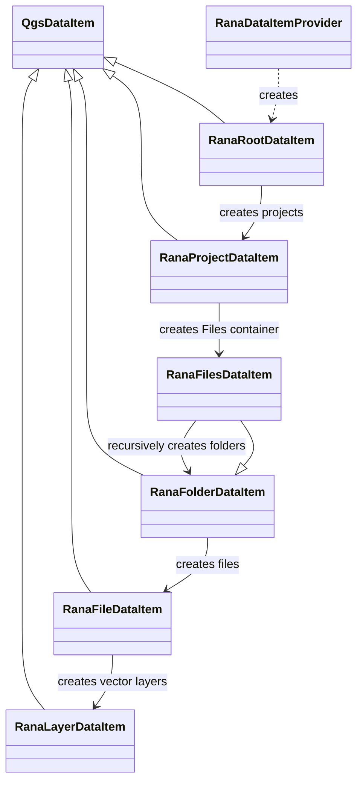
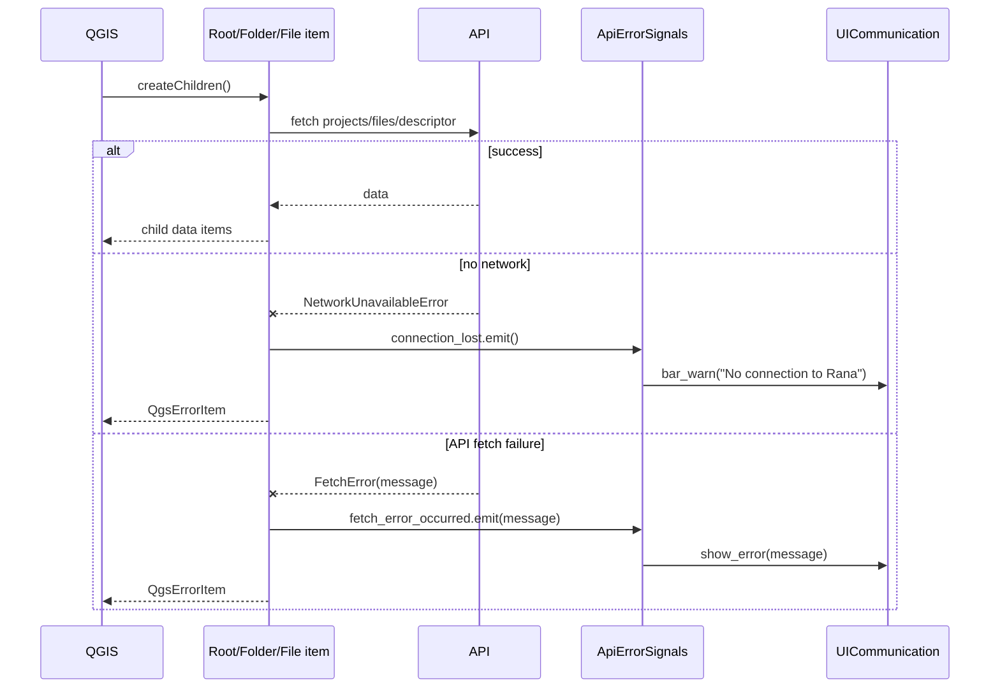

## Browser model

All model classes are `QgsDataItem` subclasses. Collection items are fertile and
load children lazily through `createChildren()`, which QGIS may invoke in a
background thread. Leaf items are marked populated and do not issue requests.

### Root: `RanaRootDataItem`

The root is always visible at `/Rana`. On construction it updates its display
name (`Rana` or `Rana [tenant]`) and restores an existing session. Authentication
details are documented in [the authentication flow](auth-flow.md).
Its context menu changes with authentication state:

- unauthenticated: Login and Settings;
- authenticated: Refresh, Logout, optional Switch tenant, Select projects, and
  Settings.

Expanding an authenticated root calls `get_tenant_projects()`. Hidden project
IDs are filtered using the tenant-specific settings before
`RanaProjectDataItem` instances are returned.

The root item orchestrates login, logout, and tenant switching while the auth
module provides credential and OAuth helpers. It updates its display and refreshes
the tree when those operations complete. Successful Rana login also creates or
reuses the user's 3Di QGIS authentication configuration.

### Project: `RanaProjectDataItem`

A project is a fertile collection at `/Rana/projects/{project_id}`. Expanding
it creates one `RanaFilesDataItem`. Its actions open the project in the web
application or hide it in tenant settings; hiding refreshes the parent.

### Folders: `RanaFolderDataItem` and `RanaFilesDataItem`

`RanaFilesDataItem` is the root-folder specialization with an empty folder path
and display name `Files`. A folder expansion calls
`get_tenant_project_files(project_id, params={"path": folder_path})` (omitting
the parameter for the root). Directory records recursively produce folders;
other records produce files. Folder actions are currently created as
unconnected `QAction` objects and vary for the root folder (root folders cannot
be deleted).

### Files: `RanaFileDataItem`

Files are custom items. Their icon and actions depend on `data_type`. Vector
files with a descriptor ID are fertile; raster and other file types are marked
populated. Expanding a vector file fetches its descriptor and creates one
`RanaLayerDataItem` per descriptor layer.

### Layers: `RanaLayerDataItem`

A layer is a populated custom leaf. It stores descriptor/layer identifiers,
uses the geometry type for its icon, and exposes an unconnected `Open in QGIS`
action.

## Signals and error handling

The shared signal hub has two signals:

- `connection_lost`: emitted for `NetworkUnavailableError`;
- `fetch_error_occurred(str)`: emitted for `FetchError`, carrying the API error.

The provider connects these to a UI error dialog and a warning message bar.
Every network-backed `createChildren()` catches both exception types, emits the
appropriate signal, and returns a `QgsErrorItem` in the browser tree. Thus the
user receives both immediate UI feedback and an item-level explanation:

Authentication errors are handled at the root-item UI boundary using message-bar
notifications, error signals, and boolean results rather than `QgsErrorItem`s;
see [the authentication flow](auth-flow.md) for their handling. Logout clears both
Rana and 3Di credentials and refreshes the display.
