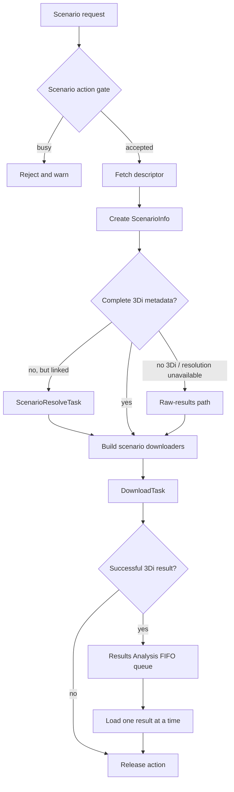
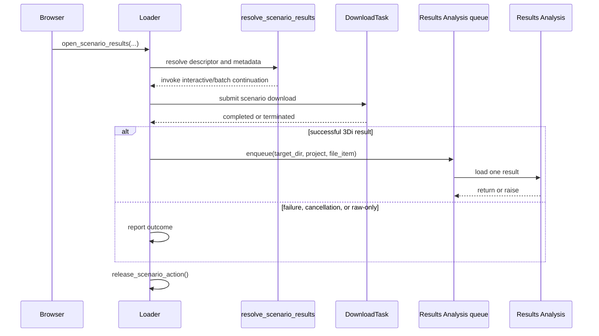
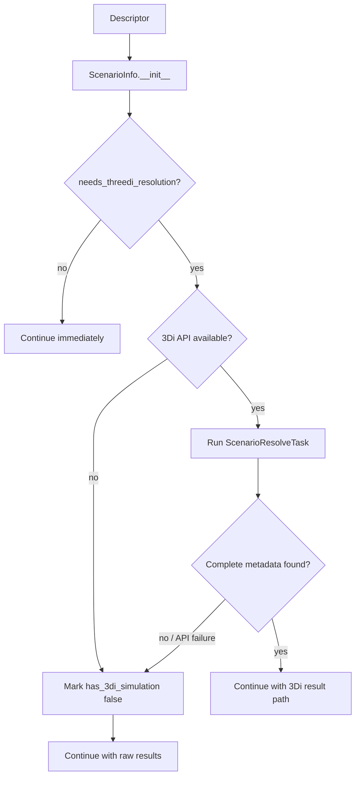
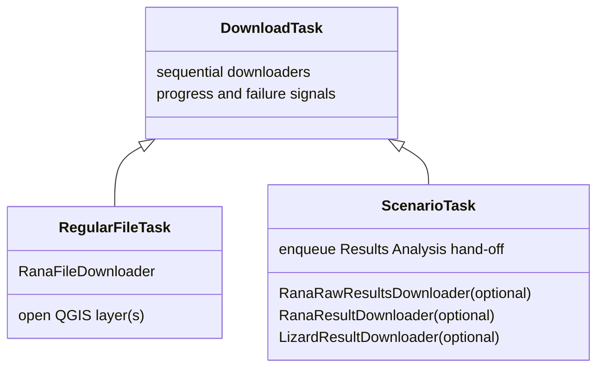
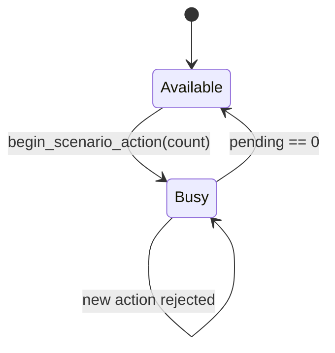
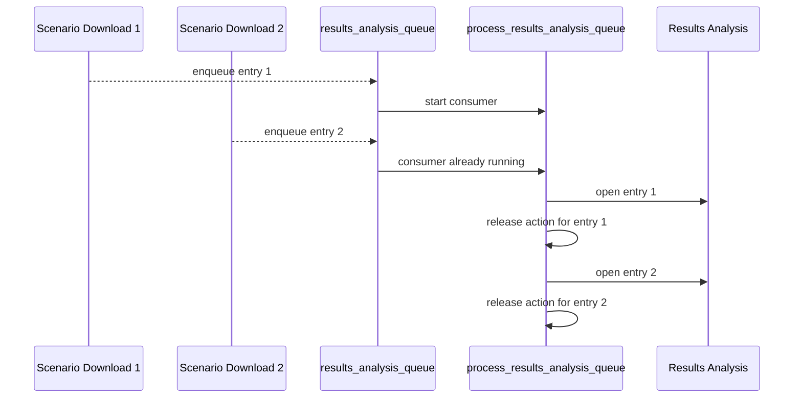

# Scenario results

This document describes the scenario-specific part of the download and opening
pipeline. General download-task behavior is documented in
[`download_workers.md`](download_workers.md); this document explains why
scenarios need additional orchestration and how that orchestration is
implemented.

## What is different about scenarios?

A regular Rana file download generally has one destination, one file
downloader, and a direct hand-off to QGIS layer creation. A scenario result
download differs in three important ways:

| Concern | Regular file | Scenario result |
|---|---|---|
| Contents | One file and optional style | Raw `results.zip` plus optional attached or generated results |
| Destination | Determined from file metadata | Depends on whether complete 3Di simulation metadata is available |
| Completion | Open as QGIS layer(s) | Hand off `results_3di.nc` and `gridadmin.h5` to Results Analysis |
| Concurrency | Tasks can complete independently | New scenario actions are gated and Results Analysis opening is serialized |

The scenario pipeline therefore adds three mechanisms around the ordinary
`DownloadTask`:

- a **metadata-resolution phase** before result downloaders are built;
- an **action gate** that prevents overlapping scenario actions; and
- a **Results Analysis queue** that serializes post-download hand-offs.

## Architecture

### Entry points and phases

The Browser routes scenario files to `Loader` through
`data_items/file_item.py`. The relevant entry points are:

- `open_scenario_results()` for one scenario with interactive result
  selection;
- `open_scenario_results_batch()` for a scenario in a multi-item operation,
  using fixed defaults.

Both paths use `resolve_scenario_results()` before constructing downloaders.
The continuation passed to that method determines whether the interactive or
batch policy is applied.

### Scenario metadata resolution

`ScenarioInfo` construction is synchronous and descriptor-only. It copies
simulation and schematisation fields from the descriptor and initially sets
`has_3di_simulation` from the presence of a simulation ID. It does not call the
3Di API.

When `needs_threedi_resolution` is true, `Loader` creates a
`ScenarioResolveTask`. The task calls
`ScenarioInfo.set_simulation_info_from_threedi()` through the QGIS task
manager. Downloader construction waits for the task's completion signal.

If the API is unavailable or resolution cannot produce complete metadata, the

### Download composition

The ordinary `DownloadTask` remains responsible for sequentially running
downloaders. What is special is how the loader composes them:

The interactive continuation uses `ResultBrowser` to choose Lizard results,
generated-raster parameters, and whether to download raw results. The batch

## Scenario-specific coordination

### Action gate

`Loader` stores:

- `scenario_action_busy`: a re-entry guard for new scenario actions; and
- `scenario_action_pending`: the number of accepted scenarios that have not
  reached a terminal outcome.

The two values serve different purposes. The boolean rejects a new single or
batch action immediately, while the counter allows one accepted batch to track
several independent scenario tasks.

`begin_scenario_action()` reports a modal warning for a rejected single
scenario and a message-bar warning for a rejected batch. Every accepted
scenario must release exactly once on one of these paths:

- descriptor missing, unavailable, or not ready;
- resolution cancelled or terminated;
- interactive dialog cancelled or produces no downloaders;
- batch prerequisites are not met;
- the download task cannot start or terminates; or
- Results Analysis hand-off finishes, including an exception.

When the counter reaches zero, the busy flag and progress message are cleared.
Any new early return after `begin_scenario_action()` must therefore be checked
for a corresponding release.

### Results Analysis serialization

Scenario download tasks are independent and may finish in different orders.
Their Results Analysis hand-offs are not independent: the loader maintains
`results_analysis_queue` entries of the form
`(target_dir, project, file_item)` and drains them FIFO.

`results_analysis_loading` prevents re-entry when another download completes
while the queue is being drained. A failed hand-off is reported but does not
stop the loop. This serialization keeps calls into the Results Analysis plugin
ordered and prevents concurrent loading from racing inside that integration;
it does not serialize the downloads themselves.

### Results Analysis boundary

`open_scenario_results_in_results_analysis()` is the only integration boundary
between the loader and the Results Analysis plugin. It returns without loading
when either `results_3di.nc` or `gridadmin.h5` is absent. If the plugin is
missing or has no `load_result` method, it reports a warning.

The call supports installed Results Analysis versions with different APIs:

1. call `load_result(..., group_path=[project, "files", *file parts])`;
2. on an unsupported `group_path` argument, retry with `project=...`; and
3. on an unsupported `project` argument, load without grouping and warn that
   the plugin should be updated.

After loading, the Results Analysis dock widget is shown if it is not visible.
The compatibility logic stays at this boundary so scenario callers can always
pass the same project and file-item data.

## Lifecycle invariants

When changing scenario handling, preserve these invariants:

- An accepted scenario action is released exactly once.
- A successful 3Di result download enqueues exactly one Results Analysis
  entry.
- Queue processing remains FIFO and non-reentrant.
- A failed hand-off does not discard later queue entries.
- Metadata resolution completes before `ResultsDownloadContext` paths are
  constructed.
- Raw-only scenarios are not queued for Results Analysis.

