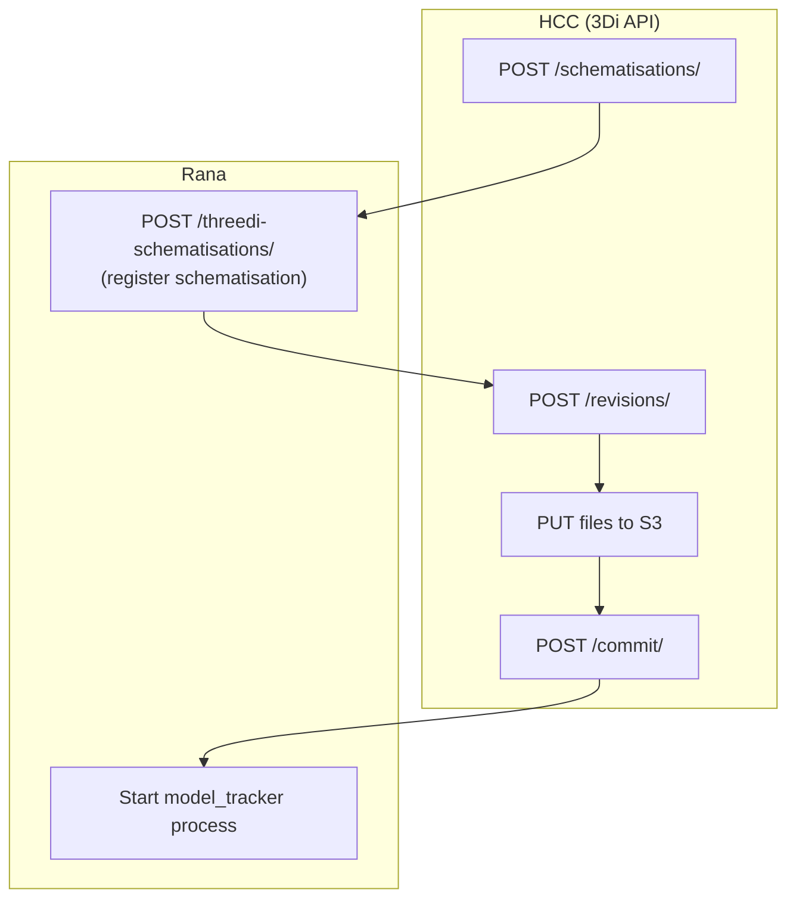
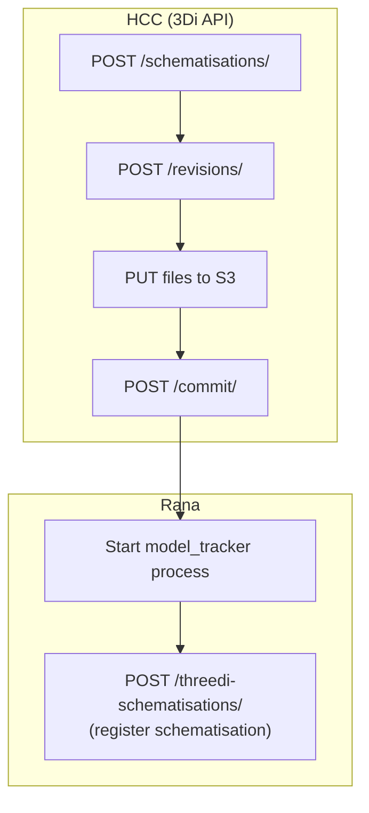

# Adding a schematisation

**Version: 1.2.15+**

## Overview

This document describes the API interactions when creating a schematisation in the RANA QGIS plugin. Two entry points are supported:

- **New schematisation** — user defines schema and data via a 3-page wizard
- **Existing schematisation** — user provides an existing GeoPackage/SQLite file

Both flows result in the same sequence of API calls to HCC and Rana.

## Simplified flow diagram

## Key changes

### v1.2.15+

**From v1.2.15 onwards:** Rana registration happens **last**, after the revision is fully committed to HCC and model creation is requested. This ensures the schematisation is validated and complete on HCC before Rana registration.

