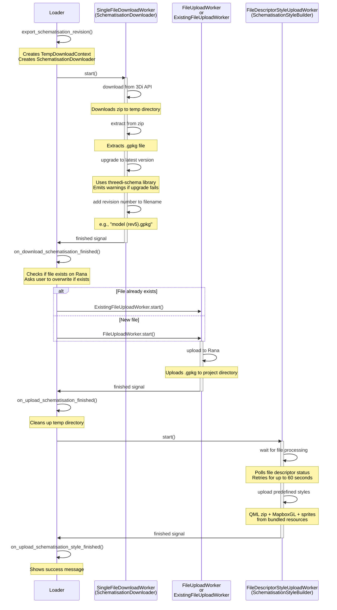

# Schematisation Export Flow

## Overview

Schematisation export is a multi-stage workflow that downloads a 3Di schematisation revision, processes it, uploads it to Rana, and applies styling. The flow chains together three workers in sequence: download worker → upload worker → style upload worker.

The process ensures schematisations are upgraded to the latest schema version before being stored in Rana, and automatically applies predefined 3Di styling for consistent visualization.

## Flow Diagram



## Workflow Stages

### Stage 1: Download from 3Di

**Trigger**: User selects "Export schematisation" from file menu (`loader.py:487-513`)

**Worker**: `SingleFileDownloadWorker` with `SchematisationDownloader`

**Steps**:
1. Creates `TempDownloadContext` for transient storage (schematisation will be uploaded, not kept locally)
2. Downloads schematisation revision sqlite from 3Di API as zip file
3. Extracts .gpkg file from zip to temp directory
4. Upgrades schematisation to latest schema version using `threedi-schema` library
   - Emits warnings if upgrade fails (continues with original version)
5. Adds revision number to filename (e.g., `model (rev5).gpkg`)
6. Emits `finished` signal with path to processed file

**Error handling**:
- Download failures emit `failed` signal
- Schema upgrade failures emit `warning` signal but don't stop the flow

### Stage 2: Upload to Rana

**Trigger**: Download worker emits `finished` signal (`loader.py:521-571`)

**Worker**: `FileUploadWorker` (new file) or `ExistingFileUploadWorker` (overwrite)

**Steps**:
1. Determines target online path from file directory structure
2. Checks if file already exists at target path
3. If exists, asks user for confirmation to overwrite (shows who created it and when)
   - User cancels → workflow stops, temp directory cleaned up
   - User confirms → uses `ExistingFileUploadWorker` with `file_overwrite=True`
4. If new file, uses `FileUploadWorker`
5. Uploads .gpkg file to Rana project directory
6. Cleans up temp directory (on both success and failure)
7. Emits `finished` signal with online path

**Error handling**:
- Upload failures emit `failed` signal and clean up temp directory
- User cancellation clears message bar and emits `file_upload_failed`

### Stage 3: Upload Styling

**Trigger**: Upload worker emits `finished` signal (`loader.py:573-602`)

**Worker**: `FileDescriptorStyleUploadWorker` with `SchematisationStyleBuilder`

**Steps**:
1. Retrieves file descriptor for uploaded file
2. Creates `FileDescriptorStyleUploadWorker` with:
   - `DataType.schematisation`
   - `retry_timeout_seconds=60` (waits for file processing)
   - Empty `local_file_path` (uses predefined styles, not QGIS layers)
3. Worker polls file descriptor status every 2 seconds
   - Emits `retry` signal → shows busy progress bar
   - Waits up to 60 seconds for file processing to complete
4. Once ready, uploads predefined schematisation styles from bundled resources:
   - QML zip for QGIS
   - MapboxGL style JSON for web client
   - Sprite sheets (PNG + JSON at 1x and 2x)
5. Emits `finished` signal

**Error handling**:
- Timeout waiting for processing emits `failed` signal
- Upload failures emit `failed` signal
- Shows success message only after all stages complete

## Signal Chaining

The workflow uses signal chaining to sequence the three stages:

```python
# Stage 1 → Stage 2
download_worker.signals.finished.connect(
    lambda: on_download_schematisation_finished(...)
)

# Stage 2 → Stage 3
upload_worker.finished.connect(
    lambda: on_upload_schematisation_finished(...)
)

# Stage 3 → Completion
style_worker.finished.connect(
    lambda: on_upload_schematisation_style_finished(...)
)
```

Each handler method sets up the next worker and starts it, creating a sequential pipeline.

## User Interaction Points

1. **Initiation**: User selects "Export schematisation" from file context menu
2. **Overwrite confirmation**: If file exists, user confirms whether to replace it
3. **Progress updates**: Message bar shows progress through all three stages
4. **Completion**: Success message shown after styling upload completes

## Temporary File Handling

- Download stage creates unique temp directory under `rana_downloads/`
- Processed schematisation stored in temp directory until upload completes
- Temp directory cleaned up after upload (success or failure)
- No local copy of schematisation retained (use download feature for that)

## Why Three Separate Workers?

**Separation of concerns**:
- Download worker handles 3Di API and schema upgrades
- Upload worker handles Rana API and file conflicts
- Style worker handles file processing wait and style upload

**Error isolation**:
- Each stage can fail independently
- Temp cleanup happens even if upload fails
- Styling failure doesn't invalidate uploaded schematisation

**Reusability**:
- Same upload workers used for other file types
- Same style worker used for other schematisation styling operations
- Schema upgrade logic isolated in `SchematisationDownloader`

## Common Issues

**Schema upgrade warnings**: Non-fatal warnings during upgrade (e.g., EPSG code issues) are logged but don't stop the flow. The original schematisation is used if upgrade fails.

**File processing timeout**: Style upload waits 60 seconds for Rana to finish processing the uploaded file. If processing takes longer, style upload fails (but schematisation is already uploaded successfully).

**User cancellation**: Cancelling the overwrite dialog stops the workflow and cleans up temp files. The schematisation was downloaded but not uploaded.
