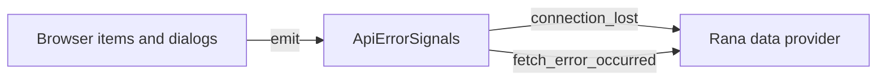
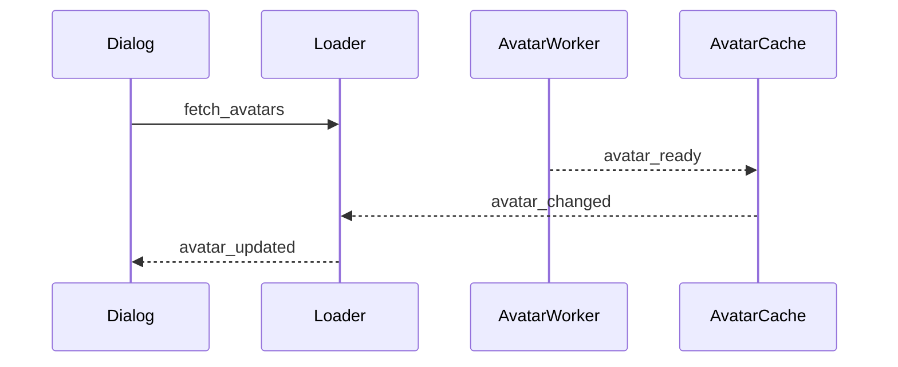
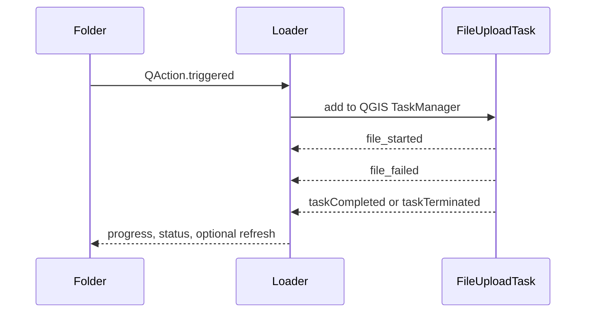
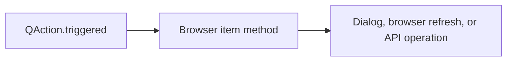

# Signals through the plugin

The plugin uses Qt signals to connect background work, browser items, dialogs,
and shared UI feedback. There is no single signal bus: most signals are
connected near the components that use them. `ApiErrorSignals` and `Loader`
are the main shared connection points.

## Error signals

`ApiErrorSignals` is passed to data items and dialogs that access the API.

- `connection_lost` indicates that the connection could not be used.
- `fetch_error_occurred` carries the error text and a severity indicator.

The provider listens for these signals and turns them into the appropriate
browser or UI response. Components may also connect directly when they need a
local response.

## Avatar loading

Avatar loading is routed through `Loader` so that widgets do not manage the
worker or cache themselves.

The worker signal updates the cache. The cache signal is converted into the
loader's UI-facing `avatar_updated` signal.

## File uploads

The folder action calls `Loader.upload_files()`. Preparation is synchronous;
the actual upload runs as a QGIS task.

The loader consumes task signals and presents progress or completion through
the communication layer. It does not re-emit the task signals.

## Browser actions

Context-menu actions are regular `QAction` signals. They usually call a
method on the item directly:

Examples include login, logout, refresh, project selection, file information,
and folder upload. Only actions that need shared background orchestration are
routed through `Loader`.

## Layer reference updates

`Loader` emits these signals after a Browser operation succeeds:

- `item_renamed(old_path, new_path, project_id, is_folder)` updates the stored path on
  linked QGIS layers below the renamed file or folder;
- `item_deleted(path, project_id, is_folder)` clears Rana references on affected layers,
  leaving the QGIS layers in the project but disabling Rana sync actions.

Remote changes do not emit these signals. They are checked lazily when a save
operation is started.

## Project-selection dialog

The project-selection dialog combines model, filter, and loader signals:

- `Loader.avatar_updated` updates avatar cells.
- `FilterBar.filters_changed` updates the project list.
- Model `dataChanged` and `modelReset` synchronize checkbox state.
- View and button `clicked`, `accepted`, and `rejected` signals drive user
  interaction.

## Adding a new signal flow

Document new flows as a separate section containing:

1. The triggering signal and component.
2. The receiver or worker it invokes.
3. Signals emitted during processing.
4. The final UI update, refresh, or error path.

Keep this document focused on connections and ownership; implementation
details belong in the source code or action-specific documentation.
