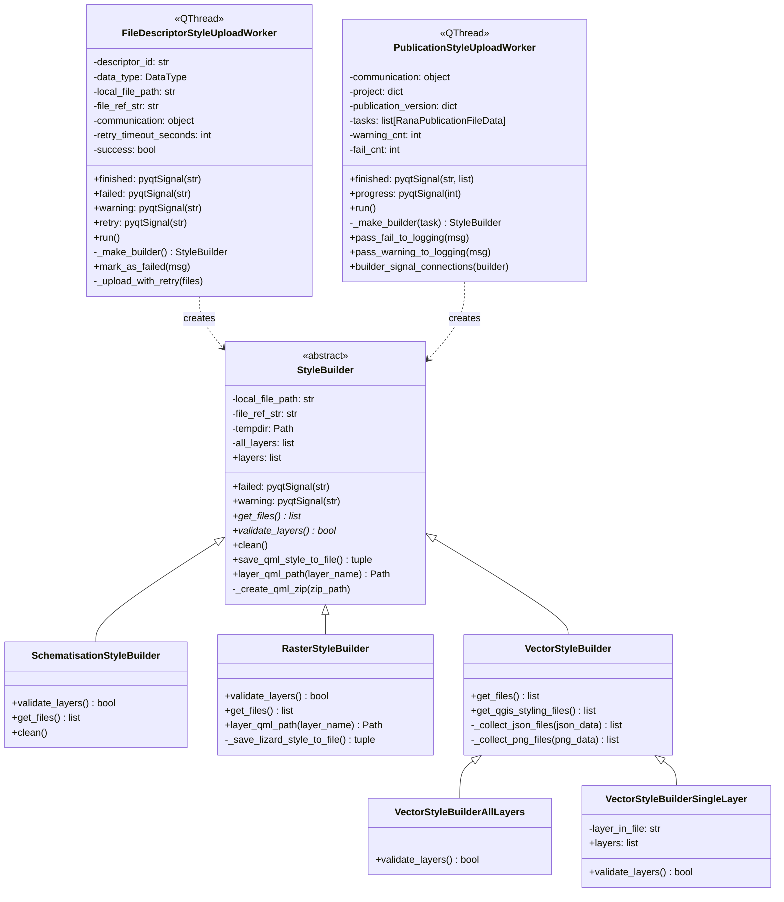

# Styling Worker Class Diagram

## Overview

The styling worker system separates the concerns of **how** to generate style files from **how** to upload them.

**Style builders** know how to convert QGIS layer styles into various formats. Each file type has its own builder: raster files generate QML and Lizard colormaps, vector files generate QML, MapboxGL styles and sprites, and schematisations use predefined styles.

**Upload workers** coordinate the style generation and upload process. They create the appropriate builder based on file type, validate that QGIS layers are loaded, collect the generated files, and upload them to the correct API endpoint (file descriptor or publication).

This separation means you can add new file types by creating new builders without changing the upload workers, and the same builders can be used in different upload contexts (individual files vs. publication batches).

## Style Builders

Style builders collect and generate style files from QGIS layers. They are context-unaware and focus solely on file generation.

- **SchematisationStyleBuilder**: Returns predefined styles from bundled resources (QML zip, MapboxGL style, sprites). QGIS layers are not required. Does not clean up permanent resource files.

- **RasterStyleBuilder**: Validates exactly one QGIS layer is loaded. Generates QML zip and Lizard colormap JSON. Converts QGIS → GeoStyler → Lizard format, validates constraints (single rule/symbolizer, no floats in DiscreteColormap).

- **VectorStyleBuilderAllLayers**: Validates at least one QGIS layer is loaded. Generates QML zip, MapboxGL style, and sprites (1x and 2x) for all layers in the file.

- **VectorStyleBuilderSingleLayer**: Validates exactly one matching layer is found (filtered by `layer_in_file` parameter). Generates QML zip, MapboxGL style, and sprites for a specific layer.

All builders provide temporary directory management, layer discovery, QML generation, signal communication (`failed`, `warning`), and cleanup.

## Upload Workers

Workers coordinate the style upload process, creating appropriate builders and handling API communication.

- **FileDescriptorStyleUploadWorker**: Uploads styles for a single file descriptor. Creates appropriate builder based on `data_type` (raster/vector/schematisation). Validates file descriptor status before upload. Optionally retries with timeout if processing is still in progress. Uploads via `upload_file_styling(descriptor_id, files)`.

- **PublicationStyleUploadWorker**: Uploads styles for multiple layers in a publication. Processes batch of tasks (one per layer). Creates builder per task. Uploads via `upload_publication_style(...)` and returns list of `(task, style_id)` tuples. Tracks statistics (warnings, failures, layers not found). Uses context manager for safe signal handling.

## Usage in Loader

The Loader class demonstrates two main usage patterns for the styling workers:

### 1. File Descriptor Style Upload (Tenant Files)

Used when saving styles for individual project files:

- Creates `FileDescriptorStyleUploadWorker` with file descriptor ID and data type
- Worker automatically selects appropriate builder:
  - `DataType.raster` → `RasterStyleBuilder`
  - `DataType.vector` → `VectorStyleBuilderAllLayers`
  - `DataType.schematisation` → `SchematisationStyleBuilder`
- Generates QML, MapboxGL styles, and sprites from QGIS layers
- Uploads to file descriptor endpoint

### 2. File Descriptor Style Upload with Retry (Schematisation Export)

Used after uploading schematisations to ensure file processing completes:

- Creates `FileDescriptorStyleUploadWorker` with `retry_timeout_seconds=60`
- Worker polls file descriptor status every 2 seconds
- Waits for file processing to complete before uploading styles
- Emits `retry` signal to show busy progress indicator
- Uses predefined schematisation styles (QML + MapboxGL + sprites)

### 3. Publication Style Upload (Batch)

Used when saving styles for multiple publication layers:

- Creates `PublicationStyleUploadWorker` with list of tasks (one per layer)
- Worker processes each task sequentially:
  - Creates `VectorStyleBuilderSingleLayer` or `RasterStyleBuilder` per layer
  - Generates and uploads styles for each layer
  - Returns list of `(task, style_id)` tuples
- Completion handler updates publication version with new style IDs
- Handles version conflicts with retry logic
- Shows progress updates (e.g., "Generating and saving styling files (3 out of 10)")

