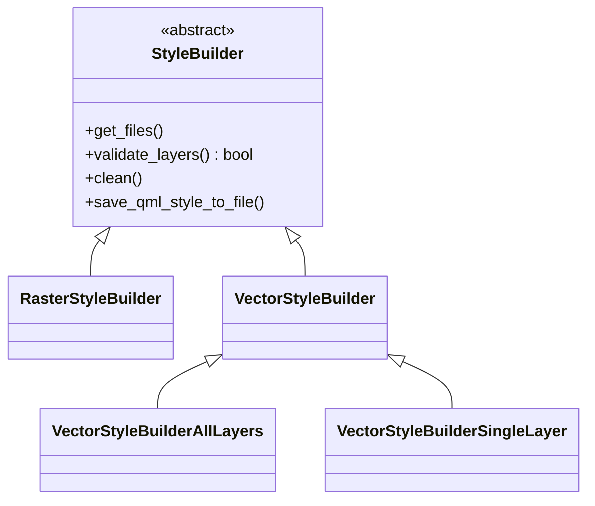
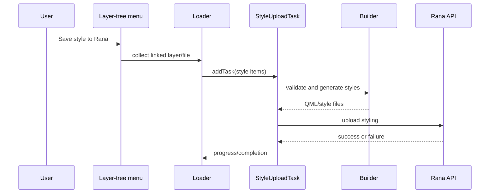

# Styling uploads

## Overview

Styling uploads convert QGIS layer styles into the files expected by Rana and
upload them in a background QGIS task. The implementation uses
`StyleUploadTask` (`QgsTask`).

The process is separated into:

- **style builders**, which discover layers and generate QML and other style
  files; and
- **`StyleUploadTask`**, which selects a builder, validates it, uploads the
  generated files, and reports progress.

## Style builders

```mermaid
classDiagram
    class StyleBuilder {
        <<abstract>>
        +get_files()
        +validate_layers() bool
        +clean()
        +save_qml_style_to_file()
    }
    class RasterStyleBuilder
    class VectorStyleBuilder
    class VectorStyleBuilderAllLayers
    class VectorStyleBuilderSingleLayer

    StyleBuilder <|-- RasterStyleBuilder
    StyleBuilder <|-- VectorStyleBuilder
    VectorStyleBuilder <|-- VectorStyleBuilderAllLayers
    VectorStyleBuilder <|-- VectorStyleBuilderSingleLayer
```

The builder is selected from the file data type:

- `RasterStyleBuilder` handles one raster layer;
- `VectorStyleBuilderAllLayers` handles all layers in a vector file;
- `VectorStyleBuilderSingleLayer` handles one named layer in a vector file;

Builders generate and validate styles without owning API orchestration:

- `RasterStyleBuilder` validates one raster layer and generates QML and
  colormap data.
- `VectorStyleBuilderAllLayers` generates styles for all layers in a vector
  file.
- `VectorStyleBuilderSingleLayer` selects and styles one named vector layer.

The vector builders share layer discovery and QML generation behavior. Builders
use temporary directories and clean them after generation.

Builders use a temporary directory for generated files and clean it up after
each item. A builder must find the expected QGIS layer(s) before an upload can
start.

## `StyleUploadTask`

`StyleUploadTask` accepts one or more `StyleUploadItem` objects and processes
them sequentially in the QGIS task manager. For each item it:

1. checks cancellation;
2. creates and validates the appropriate builder;
3. generates the style files;
4. calls the item's upload function; and
5. emits completion or failure and cleans up temporary files.

```mermaid
sequenceDiagram
    participant User
    participant Menu as Layer-tree menu
    participant Loader
    participant Task as StyleUploadTask
    participant Builder
    participant Rana as Rana API

    User->>Menu: Save style to Rana
    Menu->>Loader: collect linked layer/file
    Loader->>Task: addTask(style items)
    Task->>Builder: validate and generate styles
    Builder-->>Task: QML/style files
    Task->>Rana: upload styling
    Rana-->>Task: success or failure
    Task-->>Loader: progress/completion
```

## Layer-panel actions

Rana-linked groups in the QGIS layer panel expose **Save style to Rana** (or
**Save styles to Rana** for a folder containing multiple files). The action is
enabled only when a linked layer has a dirty style state. It is disabled while
the referenced Rana file is being synchronized.

Data synchronization is separate from styling and is file-level only. An
individual layer inside a multi-layer vector file cannot upload data by
itself, because Rana replaces the complete file. See
[`layer_management.md`](layer_management.md) for the complete user flow.

## Dirty state and failures

`styleChanged` marks a linked layer with `rana/style_dirty`. The flag is
cleared only after a successful style upload; failures and cancellation leave
it set so the user can retry. There is currently no separate layer-tree badge:
the dirty state is reflected by the enabled/disabled context-menu action.

Before a style upload, the loader verifies that the Rana file descriptor still
exists. An authoritative not-found response clears the link and disables
future Rana actions for that layer. Network and other transient errors abort
that attempt but preserve the link for a later retry.
